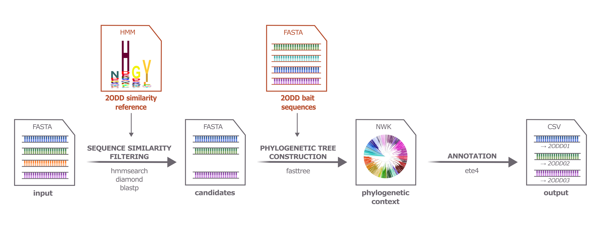
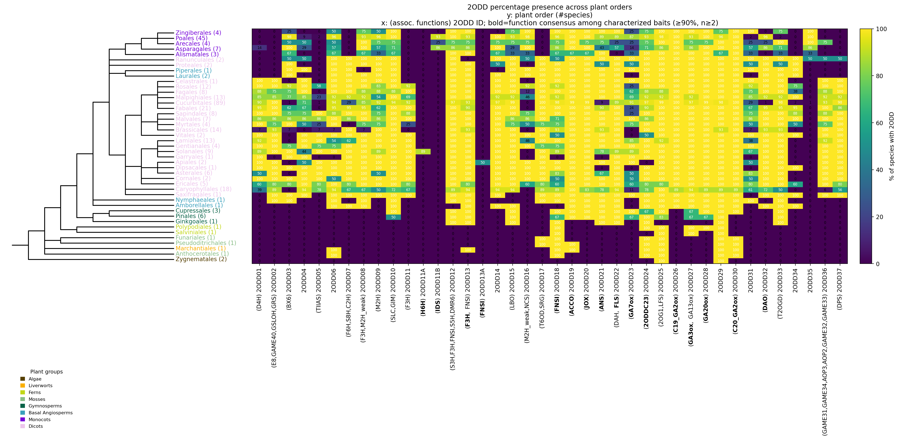

# two_odd_annotator

<br><br>
<p align="center">

</p>
<br>

The `two_odd_annotator` is a Python bioinformatics tool that lets you find putative 2‑oxoglutarate/Fe(II)‑dependent dioxygenases (2ODDs) in plant genome datasets and annotates them based on their phylogenetic relationships to a well-curated set of bait 2ODD sequences.


## Contents
- [Overview](#overview)
  - [Bait sequence collection](#bait-sequence-collection)
  - [Pipeline workflow](#pipeline-workflow)
- [Installation](#installation)
- [Configuration](#configuration)
- [Usage](#usage)
  - [Basic CLI usage](#basic-cli-usage)
  - [Interpreting output files](#interpreting-output-files)
    - [cluster_results.tsv](#cluster_resultstsv)
    - [annotation_results.tsv](#annotation_resultstsv)
  - [Python usage](#python-usage)
- [Under the hood: implementation details](#under-the-hood-implementation-details)
  - [Pipeline orchestration](#pipeline-orchestration)
  - [Sequence-similarity filtering](#sequence-similarity-filtering)
  - [Annotation](#annotation)
  - [Analysis](#analysis)

## Overview

In the era of high-throughput sequencing, functional annotation of genes became the new bottleneck in the analysis of genomes. For large gene families it is especially challenging due to the high sequence similarity between the family members. 2‑oxoglutarate/Fe(II)‑dependent dioxygenases (2ODDs) are the second largest gene family in plants, and encompass over 40 distinct enzymatic functions across various metabolic pathways. 

### Bait sequence collection

The `two_odd_annotator` relies on a carefully curated collection of “bait” 2ODD sequences. The foundation of all references for this software consists of 313 [experimentally characterized 2ODD sequences](data/2ODDs/characterized_2ODDs.fasta) from the literature. The `two_odd_annotator` can utilize [diamond](data/2ODDs/dmnd_ref_db.dmnd) / [blast+](data/2ODDs/blast_ref_db) reference database and / or the [Hidden Markov Model (HMM) profile](data/2ODDs/2ODD_domain.hmm) for the [sequence-similarity filtering](#sequence-similarity-filtering) step. All these similarity-references were built from these 313 characterized bait sequences. 


As some functional classes of the *characterized* sequence collection are underrepresented or taxonomic diversity is limited, the bait sequence collection has been expanded by incorporating the 2ODD-like sequences from 200 plant species spanning 43 taxonomic orders. For the detailed expansion workflow on the expansion and careful curation and optimization of the bait sequence collection, checkout [bait_sequence_collection repository](https://github.com/michelleAlexan/bait_sequence_collection). 


From this expanded set of ~14,000 sequences, a phylogenetic tree was constructed to identify well-supported functional clades (see Figure 1). Each was given a 2ODD ID in the format “2ODD#” (e.g. 2ODD01), and nested clades are denoted with an additional letter (e.g., it is known that the flavonoid-pathway-related gene FNSI (2OOD13A) is nested in the F3H (2ODD13) clade). This tree serves as the *curated reference tree* in downstream annotation steps. 


<p align="center">

<figcaption>Figure 1 The phylogenetic tree of ~14,000 2ODD sequences from over 200 plant species. Each well-supported functional clade was assign an unique 2ODD ID, small clades were classified as "minor_2ODD_clusters". Clades containing at least two characterized sequences with the same function and/or metabolic pathway are annotated with the function (black) and the corresponding metabolic pathway (light grey). The tree was created and visualized using ETE4 and edited in Inkscape.</figcaption>
</p>

The mapping of all 14,000 sequences to their assigned 2ODD ID is available in [major_minor_2ODD_ids_manual.json](data/2ODDs/major_minor_2ODD_ids_manual.json). The information on which characterized sequences are represented in which 2ODD ID is available in [major_2ODD_char_info.json](data/2ODDs/major_2ODD_char_info.json).

The `two_odd_annotator` uses this expanded bait sequence collection as the reference for the phylogeny-evidence-based annotation. Since using a 14k collection of bait sequences is computationally expensive, the bait sequence collection is reduced down to ~ 5,200 sequences. Again, the details of how the reduced bait sequence collection was created can be found in the [bait_sequence_collection repository](https://github.com/michelleAlexan/bait_sequence_collection).
This collection of 5,200 baits are saved in the [bait sequence collection](data/2ODDs/bait_sequence_collection.fasta) file that is used with every `annotate` run (see [Annotation](#annotation)). 


### Pipeline workflow

Broadly speaking, the `two_odd_annotator` takes as input a set of plant protein FASTA files (one file per species), identifies candidate 2ODD‑like sequences based on sequence similarity to the reference, and then annotates them based on their phylogenetic relationships to the curated bait sequences (see Figure 2).

<p align="center">

<figcaption>Figure 2 Broad workflow of the `two_odd_annotator` package. The user input are plant protein FASTA files, which are pre-filtered for 2ODD‑like sequences using a 2ODD similarity reference. Next, a phylogenetic tree is constructed using the pre-filtered sequences from all species and the bait sequence collection. Finally, the candidate sequences are annotated based on their phylogenetic relationships to the curated bait sequences. Files in orange indicate data provided by the software.</figcaption>
</p>


Detailed speaking, the data flow of the pipeline is as follows (see Figure 3):
1. The user provides a path to an input folder containing plant protein FASTA files (one per species) and a path to an output folder where the result files should be written. Additionally, the user can provide a YAML configuration file where parameters like for the sequence-similarity filtering and annotation steps can be set. If no config path is provided, the pipeline will use the [default configuration](configs/default_config.yml).
2. The output folder structure is initialized (by the [pipeline-orchestration](#pipeline-orchestration)) with one subdirectory per species (named after the species name inferred from the input FASTA filename).
    - A copy with cleaned headers of the input FASTA is saved in the corresponding species. 
    - A mapping of old sequence headers to cleaned headers is saved.
    - In case the species name cannot be correctly inferred from the filename, the user can provide a custom mapping of incorrect to correct species names in the config file.
3. For each species, 2ODD candidates are [pre-filtered using sequence similarity search tools](#sequence-similarity-filtering) against a 2ODD reference (HMMER/DIAMOND/BLASTP). By default, HMMER method is used.
    - This results in three output files per species: 
      - the raw output of the similarity search, 
      - a filtered table of hits that pass the defined thresholds (set in the config file), 
      - and a FASTA file containing the filtered candidate sequences.
4. Then, the actual annotation step is performed based on phylogenetic relationships to the bait sequence collection. For this, the following steps are performed:
    - an annotation FASTA is built by merging the filtered candidate sequences from all species with the bait sequence collection FASTA.
    - a multiple sequence alignment (MSA) is constructed from the annotation FASTA using MAFFT, and columns with gap content > 90 % are removed (trimmed).
    - a phylogenetic tree is inferred from the trimmed MSA using FastTree.
    - the tree is processed with `ete4` to assign properties to each leaf (e.g. 2ODD ID, plant group) and to identify monophyletic clusters of sequences based on shared 2ODD IDs.
    - finally, candidate sequences are annotated based on their monophyletic cluster membership and their phylogenetic proximity to characterized bait sequences.
5. Optionally, an analysis summary of the 2ODD ID distribution across plant taxa can be generated as a tree + heatmap.


<p align="center">

<figcaption>Figure 3 The detailed workflow of the `two_odd_annotator` pipeline, in particular the initialization, pre-filering and annotation steps are shown. Files in orange indicate data provided by the software.</figcaption>
</p>


 
## Installation

Requirements:

- Python version 3.13 (version 3.14 is not yet supported by all dependencies, e.g. `ete4`)
- A Unix‑like environment (Linux or macOS).

For **sequence-similarity filtering** (`services.seq_sim_filter`), you need at least one of the following tools installed and available on your `PATH`:

- `hmmsearch` (HMMER 3) – used for HMM‑based filtering (DEFAULT)
- `diamond` (DIAMOND) – used for DIAMOND‑based filtering.
- `blastp` (BLAST+) – used for BLASTP‑based filtering.

For **phylogenetic annotation** (`services.annotate`), you additionally need:

- `mafft` – for building the multiple sequence alignment.
- `fasttree` – for building the phylogenetic tree.

This is how to make sure the binaries required for the services you want to run are available on your `PATH`, e.g.:

```bash
which hmmsearch
which mafft
which fasttree
```

Python dependencies are managed via the project’s `pyproject.toml`. 

### Using uv (recommended for development)

```bash
git clone git@github.com:michelleAlexan/two_odd_annotator.git
cd two_odd_annotator
uv sync
source .venv/bin/activate
```

### Using pip

In a fresh virtual environment:

```bash
git clone https://github.com/michelleAlexan/two_odd_annotator.git
cd two_odd_annotator
pip install -e .
source .venv/bin/activate
```

---

## Configuration

You can configure pipeline parameters, reference databases and thresholds via a YAML file. By default, you can keep a config like `configs/default_config.yml`, but any path can be used.

**Note on paths in the config file**:
The default config uses relative paths (e.g. `data/2ODDs/...`). These paths are expected to point to the reference files shipped with / located alongside the repository.
If you copy `default_config.yml` somewhere else or run the pipeline in an environment where the `data/` folder is not present at the same relative location, update all path fields (e.g. `filter_tools.*.reference_db`, `filter_tools.hmmer.domain_model`, `annotate.*`, and `pipeline.sp_name_mapping`) to absolute paths on your machine.

Example `default_config.yml`:

```yaml
pipeline:
  reuse_existing: true # whether to reuse existing intermediate files if they exist, 
                              # set to false to force re-running all steps of the pipeline

  sp_name_mapping: "configs/sp_name_correction.json" # path to JSON file mapping species names in input FASTA headers to corrected names.
                                                  # this is needed, e.g.,  when the latin species name does not map to a taxonomic ID in the NCBI taxonomy database

  seq_sim_method: "hmmer"  # default method for sequence similarity filtering, 
                              # choices are "diamond", "hmmer", "blastp" 
  compute_plots: false # whether to compute summary plots at the end of the pipeline run

  seq_len_thresh: 100 # the length of the candidate sequence must be within +/- 100 amino acids of the median 2ODD sequence length of 349 aa. 
                      # if set to null, no length filtering will be applied.
  delete_intermediate_files: false # whether to delete intermediate files (ALIGNMENT_FASTA, ALIGNMENT_MSA, ALIGNMENT_MSA_TRIM, ALIGNMENT_TREE)

filter_tools: # paths to references for the sequence similarity filtering method
  blastp:
    reference_db: "data/2ODDs/blast_ref_db/2ODD_ref_db"

  diamond:
    reference_db: "data/2ODDs/dmnd_ref_db"  

  hmmer:
    domain_model: "data/2ODDs/2ODD_domain.hmm"


parameters:
  threads: 8
  thresholds_alignment:   # alignment filtering thresholds for DIAMOND and BLASTP methods
    evalue: 1e-5
    pident: 15.0
    length: 80
    bitscore: 40
    num_hits: 100
  
  thresholds_hmmer:  # filtering thresholds for HMMER method
    full_Evalue: 1e-5
    bestdom_Evalue: 1e-5
    full_score: 50
    bestdom_score: 50
    N: 1

annotate:
  bait_sequence_collection: "data/2ODDs/bait_sequence_collection.fasta"
  major_2ODDs_functional_characterization: "data/2ODDs/major_2ODD_char_info.json" 
  major_minor_2ODD_ids: "data/2ODDs/major_minor_2ODD_ids_manual.json"
  save_tree: true # whether to save the annotated tree as a Newick file with cluster annotations in the node labels

analyze: 
  save_plots: true # whether to generate analysis plots (phylogenetic tree + heatmap) showing the distribution of 2ODD candidates across taxa
  heatmap_taxa_rank: "family" # can be "order", "family", "genus", or "species" 
```


---

## Usage

Once installed, you can run the full pipeline from the command line using the `annodd` entry point.

### Basic CLI usage

Assuming you use the [example input data](data/example_input_folder) provided with the repository, you can run the pipeline with:

```bash
annodd \
  -i data/example_input_folder \
  -o example_run
```

To override the number of threads/CPUs without editing the config file, use `--threads`:

```bash
annodd \
  -i data/example_input_folder \
  -o example_run \
  --threads 8
```

Here `-i`/`--input-path` specify the input FASTA file or directory, and `-o`/`--output-dir` specify the output directory where all results will be written.

During the initialization phase, the input folder is scanned for FASTA files. <br>
<div style="border: 2px solid #db2d24; border-radius: 12px; padding: 0.8rem 1rem; background-color: #f6d5d5;">

**Important assumptions about input files**:
- Each input FASTA file should correspond to a single species
  - There are no duplicate species (i.e., multiple FASTA files for the same species) in the input folder.
- Each input FASTA file should be named in the format `<species_name>.pep.fasta` (e.g., `Arabidopsis_thaliana.pep.fasta`).
  - The species name is extracted from the filename (assuming the format above).
  - The NCBI taxonomic ID is then retrieved using the `ete4.NCBITaxa` module based on the species name for downstream annotation steps. 
  - Therefore, it is important that the species name in the filename matches the name recognized by NCBI taxonomy to ensure correct taxonomic ID retrieval and subsequent annotation steps.
  - If that is not the case, you can also provide the path to a [custom mapping](configs/sp_name_correction.json) in the configuration file to map the incorrect species name to the correct species name. For example, the input is called `Echinochloa_crus_galli`. The software will interpret the species name as `Echinochloa crus galli`, which is not recognized by NCBI taxonomy. In the `sp_name_correction` JSON, you can add the following entry to map the incorrect name to the correct name: `"Echinochloa crus galli": "Echinochloa crus-galli"`. The software will then use `Echinochloa crus-galli` to retrieve the taxonomic ID and proceed with the annotation steps.
  - Mapping keys are matched against the species name inferred from the filename (everything before the first `.`). Keys can be written with underscores or spaces (both are treated equivalently). For example, for `Gynostemma_pentaphyllum1.pep.fa`, you can map either `"Gynostemma_pentaphyllum1"` or `"Gynostemma pentaphyllum1"` to `"Gynostemma pentaphyllum"`.
</div>


After the run completes, `example_run` will contain:
- one subdirectory per input species (with the `hmmer` output files if `hmmer` was used as prefiltering method), and
- in the output directory, annotation files such as `annotation.fasta`, `annotation_msa.fasta`, `annotation_msa_trim.fasta`, `annotation_tree.nwk`, and `annotation_results.tsv` (if `--delete-intermediate-files` is not set to `true`, otherwise only the `annotation_results.tsv` will be retained).

In case the run was interrupted, you can control reuse of existing outputs with the `--reuse-existing` flag (or set `pipeline.reuse_existing: true` in the config).

---

### Interpreting output files

After a successful run, the main summary tables are:

- `annotation_results.tsv` in the top-level output directory.
- `cluster_results.tsv` in the top-level output directory.

Each per-species subfolder also contains a `clean_fasta_headers.json` file that maps original FASTA headers to the cleaned candidate IDs used in the tables.

#### `cluster_results.tsv`

This file contains one row per phylogenetic cluster identified in the annotation tree. Example:

| cluster_index | two_odd_id      | perc_of_ingroup_2ODD | n_ingroup_2ODD | n_candidates | plant_groups          | neighboring_cluster_idx | neighboring_cluster_dist |
|---------------|-----------------|-----------------------|----------------|-------------|-----------------------|-------------------------|--------------------------|
| 0             | 2ODD15          | 0.87                  | 25             | 40          | Dicots, Monocots     | 1                       | 0.12                     |
| 1             | 2ODD19          | 0.65                  | 12             | 18          | Dicots, Gymnosperms  | 0                       | 0.12                     |
| 2             | candidates_only |                       | 0              | 7           | Monocots             | 0                       | 0.35                     |

- `cluster_index`: Integer index of the cluster (used internally and for diagnostics).
- `two_odd_id`: The 2ODD ID assigned to this cluster. For clusters that only contain candidates (no ingroup bait sequences), this is set to `candidates_only`.
- `perc_of_ingroup_2ODD`: Fraction of all ingroup bait sequences for this 2ODD ID that fall into this cluster. Values ≥ 0.8 (80%) indicate a well-resolved cluster.
- `n_ingroup_2ODD`: Number of ingroup (bait) sequences of this 2ODD ID in the cluster.
- `n_candidates`: Number of candidate sequences in the cluster.
- `plant_groups`: Comma-separated list of plant groups represented by ingroup sequences in the cluster (e.g. Dicots, Monocots).
- `neighboring_cluster_idx`: Index of the closest neighbouring cluster in tree space.
- `neighboring_cluster_dist`: Tree distance to that closest neighbouring cluster.

You can use `cluster_results.tsv` to assess how well supported each 2ODD ID is and to inspect nearby clusters that might be functionally related.

#### `annotation_results.tsv`

This file contains one row per candidate sequence, summarising its annotation and linking it back to the cluster-level information. Example:

| candidate                                           | annotated_two_odd_id | annotated_function | annotated_metabolic_pathway | cluster_index | cluster_two_odd_id | associated_functions | associated_metabolic_pathways | species               |
|-----------------------------------------------------|----------------------|--------------------|-----------------------------|---------------|--------------------|----------------------|-------------------------------|-----------------------|
| XM_002873456.1_F3H_Arabidopsis_thaliana__3702       | 2ODD13               | F3H                | flavonoid_pathway           | 0             | 2ODD13             | F3H                  | flavonoid_pathway             | Arabidopsis thaliana |
| XP_019283746.1_unknown_Oryza_sativa__4530           |                      |                    |                             | 1             | 2ODD09             | M2H                  | melatonin_catabolism | Oryza sativa         |
| lcl_contig00042_12345_predicted_protein__3702       |                      |                    |                             | 2             | candidates_only    |                      |                               | Arabidopsis thaliana |

Columns:

- `candidate`: Cleaned sequence identifier used throughout the pipeline. The original FASTA headers for each species can be looked up in the corresponding `clean_fasta_headers.json` file inside that species’ subfolder in the output directory.
- `annotated_two_odd_id`: The final 2ODD ID assigned to the candidate when the cluster is considered well resolved (typically `perc_of_ingroup_2ODD ≥ 0.8`). A filled value here indicates a high-confidence annotation.
- `annotated_function`: Consensus enzymatic function is only set when a high-confidence `annotated_two_odd_id` exists and the characterized baits for that 2ODD ID support a clear consensus. In detail: if ≥90% of the characterized baits with that 2ODD ID share the same function (checkout [major_2ODD_char_info.json](data/2ODDs/major_2ODD_char_info.json)), then that function is treated as the consensus function for that 2ODD ID. If further the candidate sequence fell into a cluster with a high cluster resolution (i.e., `perc_of_ingroup_2ODD` ≥ 0.8), then that 2ODD ID and its consensus function can be confidently assigned to the candidate sequence.
- `annotated_metabolic_pathway`: Consensus metabolic pathway (e.g. flavonoid_pathway), defined analogously to `annotated_function`.
- `cluster_index`: Integer index of the cluster that this candidate belongs to (matches the `cluster_index` column in `cluster_results.tsv` and can be used to inspect cluster-level statistics).
- `cluster_two_odd_id`: The 2ODD ID associated with the candidate’s cluster (or `candidates_only` if the cluster contains no ingroup baits). 
- `associated_functions`: Looking at the characterized information given for each 2ODD [check out the `major_2ODD_char_info.json` file](data/2ODDs/major_2ODD_char_info.json), these are all the functions characterized for a given 2ODD ID. If a candidate clusters with lets say 2ODD13, then this column will list all the functions that are characterized for 2ODD13, which is primarily F3H. This provides an overview of which functions are associated with the 2ODD ID the candidate clusters with. However, this does not necessarily be the true function of the candidate. 
- `associated_metabolic_pathways`: Similar to `associated_functions`, but for metabolic pathways.
- `species`: Human-readable species name corresponding to the taxonomic ID encoded in the candidate header, resolved via the NCBI taxonomy database.

In short, the `annotated_*` columns reflect high-certainty assignments for individual candidates, while `cluster_index`/`cluster_two_odd_id` together with `consensus_function` and `consensus_metabolic_pathway` describe what the surrounding cluster is likely doing, even when the candidate itself does not cross the resolution threshold.


### Python usage

```python
from pathlib import Path
import yaml
from two_odd_annotator.runner import Runner

config = yaml.safe_load(open("configs/filter.yml"))
input_dir = Path("path/to/folder/containing/input/FASTA/files")
results_dir = Path("results")
# Initialize pipeline
pipeline = Runner(
    input_path= input_dir,
    output_base_dir= results_dir,
    config=config
)
pipeline.run()
```

---


## Under the hood: implementation details
### Pipeline orchestration
The [pipeline.runner class](src/two_odd_annotator/pipeline/runner.py) orchestrates the initialization and execution of the main services. Each time you want to run the pipeline, you create a `Runner` instance with your configuration and call its `run` method. In its simplest form, it looks like this:

```
# Initialize pipeline
pipeline = Runner(
    input_path= "path to folder containing input FASTA files",
    output_base_dir= "path to folder where results should be written"
)

pipeline.run()
```

The `Runner` class handles the following steps:
1. **Configuration loading**: It loads the YAML configuration file that specifies parameters for the sequence-similarity filtering and annotation steps, as well as paths to reference databases and other resources.
2. **State initialization**: A [pipeline.state.State](src/two_odd_annotator/pipeline/state.py) object scans the input for FASTA files, infers species names, creates/updates one subdirectory per species under the output directory, and records which filtering and annotation steps have already been completed (based on existing output files) if `pipeline.reuse_existing: true` is set in the config.
3. **Service execution**:
  - For each species subdirectory, the sequence-similarity filtering service is run (unless its expected outputs already exist and reuse is enabled).
  - After all species have been filtered, the annotation service is called once on the whole output directory. It can reuse existing intermediate annotation outputs (`annotation.fasta`, MSA, trimmed MSA, tree) when `reuse_existing` is enabled, or recompute them from scratch otherwise.
4. **Result management**: It ensures that intermediate and final results are saved in an organized manner under the specified output directory. Optionally, intermediate annotation files (FASTA/MSA/tree) can be deleted after a successful run if `pipeline.delete_intermediate_files: true` is set in the config.


### Sequence-similarity filtering

The [sequence-similarity filtering service](src/two_odd_annotator/services/seq_sim_filter.py) identifies candidate 2ODD‑like proteins from the input plant `.pep.fasta` files. It supports three methods for sequence similarity search:
- **HMMER**: which uses profile Hidden Markov Models (HMMs) to identify sequences matching a specific domain profile (in this case, the 2ODD domain).
- **DIAMOND**: a fast sequence aligner that can be used for large datasets
- **BLASTP**: the classic BLAST tool for protein sequence alignment, which is widely used but can be slower than DIAMOND for large datasets.

DIAMOND and BLASTP are both sequence-alignment methods that rely on a reference database of 2ODD sequences. The thresholds for filtering hits (e.g., minimum percent identity, alignment length, bitscore) can be configured in the [configuration file](configs/default_config.yml). Users can create their own config file and specify the path to the config when initializing the `Runner` class. By default, the `Runner` will use the project's default config. 

Similarly, the HMMER method relies on a 2ODD domain HMM profile, and hits are filtered based on E-value and score thresholds.


### Annotation

The phylogeny-based annotation workflow is implemented in  
`src/two_odd_annotator/services/annotate.py`.

Here, I want to acknowledge the ETE4 library, which laid the foundation for the tree-based annotation approach implemented in this service. The integrated manipulation and annotation capabilities saved a lot of work in enabling this annotation service. 

At a high level, the procedure builds a combined reference–candidate tree and assigns functions to candidate sequences based on their phylogenetic placement relative to curated 2ODD clades.

---

1. Build annotation FASTA

- Starts from the bait_sequence_collection FASTA, to which the path is defined in the config (`annotate.bait_sequence_collection`).
- Adds all candidate sequences from the `filtered_*.fasta` files in the results/ specified output directory.
- Duplicate sequence IDs are removed.
- Output: a combined FASTA containing both reference (bait) and candidate sequences (is saved as `annotation.fasta` in the results directory).

---

2. Construct MSA and phylogenetic tree

- Multiple sequence alignment is generated using **MAFFT**.
- Columns with high gap content (default: 90%) are removed.
- A phylogenetic tree is inferred from the trimmed alignment using **FastTree**.
- Optionally, the tree can be saved for inspection.

---

3. Annotate tree leaves

- The tree is processed with `ete4`:
  - NCBI taxonomy is assigned to all leaves (and internal nodes) based on their species, allowing for taxonomic annotation.
  - Each sequence is classified into a coarse plant group (e.g. Monocots, Dicots, Gymnosperms).
- Leaves get a `two_odd_id` property based on the mapping from the bait sequence collection:
  - If the sequence is in the ingroup (i.e., part of the bait collection), it is labeled with its assigned 2ODD ID (e.g. `2ODD15`).
  - Otherwise, the sequence is labeled as `candidate`.
- For characterized bait sequences, function and metabolic pathway information are parsed directly from the sequence header as properties (e.g. `function = F3H`, `metabolic_pathway = flavonoid`).

---

4. Identify monophyletic clusters

- The tree is partitioned into **maximal monophyletic clusters** based on shared 2ODD IDs.
  - this means, that a cluster is defined as a monophyletic clade where all ingroup sequences share the same 2ODD ID, but candidates are treated as transparent (i.e., they do not break monophyly if they are interspersed).
- Nested clusters also dont break monophyly, meaning that if a smaller clade with a different 2ODD ID is nested inside a larger clade, the larger clade can still be considered a cluster as long as all its ingroup sequences share the same 2ODD ID.
- Each cluster is assigned a unique index and the following properties:
  - `two_odd_id`: the shared 2ODD ID of that cluster (e.g. 2ODD15). If only candidates are present, then `two_odd_id = unresolved`
  - `perc_of_ingroup_2ODD`: how many percent of the baits from a given 2ODD ID are represented in that cluster (e.g. if 10 baits of 2ODD15 were used for phylogeny construction and 8 of them are in that cluster, then `perc_of_ingroup_2ODD` = 80%)
  - `n_ingroup_sequences`: number of ingroup sequence IDs in the cluster
  - `n_candidate_sequences`: number of candidate sequence IDs in the cluster
  - `plant_groups`: list of represented plant groups in the cluster (based on the species of the ingroup sequences)
  - `neighboring_cluster_idx`: the index of the closest neighboring cluster based on tree distance
  - `neighboring_cluster_dist`: the distance to the closest neighboring cluster

---

5. Link candidates to characterized baits

For each candidate sequence:

- The closest and second-closest **characterized bait sequences** are identified based on tree distance.
- The candidate is assigned:
  - cluster index
  - nearest characterized baits
  - corresponding distances

This provides local phylogenetic context even for unresolved candidates.


6. Merge infos to candidate-level table
- create a table where each row is a candidate sequence. Merge the cluster-level properties on the candidate’s assigned cluster index. 
- Merge the characerized information of the corresponding 2ODD ID taken from the [major_2ODD_char_info.json](data/2ODDs/major_2ODD_char_info.json). 
  - the `consensus_function` and `consensus_metabolic_pathway` are assigned if ≥90% of the characterized baits with the same 2ODD ID share the same function/pathway, otherwise they are set to `None`.
  This provides some context for the 2ODD ID of the cluster. If the 2ODD ID for example does not contain any characterized baits, a function or metabolic pathway cannot be assigned to that 2ODD ID and more importantly, to the candidate sequence. 
  - if however, the 2ODD ID contains characterized baits with a consistent function/pathway annotation, then that information can be transferred to the candidate sequence as well. 

---

7. Add functional annotation

The final annotation step is to assign the `annotated_two_odd_id`, `annotated_function`, and `annotated_metabolic_pathway` to each candidate sequence. 
- The `annotated_two_odd_id` is assigned based on the cluster-level properties and the candidate’s cluster membership. If the candidate is part of a cluster with a 2ODD ID that has a high cluster resolution (i.e., `perc_of_ingroup_2ODD` ≥ 80%), then that 2ODD ID is assigned to the candidate. Otherwise, not only the `annotated_two_odd_id`, but also `annotated_function` and `annotated_metabolic_pathway` are set to `None`.
- Only if a `annotated_two_odd_id` is assigned, the `annotated_function` and `annotated_metabolic_pathway` are assigned based on the `consensus_function` and `consensus_metabolic_pathway`. 

---
8. Output

The final result is a **candidate-level annotation table**, where each row contains:

- annotated 2ODD ID 
- annotated function and metabolic pathway 
- cluster-level metadata
- nearest characterized bait sequences
- metadata on the 2ODD ID such as which characterized baits are present in the 2ODD ID reference. 


### Analysis

The pipeline can generate a **taxonomically ordered presence matrix** and summary plots showing how 2ODD functional clades (major 2ODD IDs) are distributed across taxa (taxonomic ranks can be order, family, genus or species).

Run analysis explicitly:

```bash
annodd \
  -i data/example_input_folder \
  -o example_run \
  --step analyze \
  --rank order
```

You can also run it automatically at the end of a full run by setting `pipeline.compute_plots: true` in your config.

Outputs (written to the run output directory):

- `presence_matrix_<rank>.tsv` (filtered matrix; major 2ODD IDs only)
- `presence_tree_<rank>.nwk`
- `presence_heatmap_<rank>.png`

Here is an example output of applying the `two_odd_annotator` on over 300 plant species datasets. The heatmap shows the percentage presence of each major 2ODD ID (columns) across plant orders (rows). The presence is calculated as the fraction of species within that order that have at least one candidate sequence annotated with that 2ODD ID:

<p align="center">

</p>

#### How to interpret the heatmap

The plot combines a taxonomy tree (left) with a presence/percentage heatmap (right):

- **Rows (y-axis)** are taxa at the chosen rank (`order`, `family`, `genus`, or `species`). If the order is at higher ranks than on species level, then the number in the parenthesis indicates how many species datasets were included for this run. Label colors (and the legend) indicate the corresponding major plant groups (Algae, Ferns, Monocots, Dicots, etc.).
- **Columns (x-axis)** are **major 2ODD IDs** (minor IDs are excluded from the matrix/heatmap).
- **x-tick labels** are formatted as `(<associated functions>) <2ODD ID>` using the curated characterization file [data/2ODDs/major_2ODD_char_info.json](data/2ODDs/major_2ODD_char_info.json).
  - If a 2ODD ID has a strong function consensus among its characterized baits (≥90% agreement with at least 2 baits), **only that consensus function is shown in bold**.
  - If there is no clear consensus (or no characterized baits), functions are shown without bolding.
- **Cell values / colors**
  - At rank = `species`, cells are binary: **1** = that species has at least one candidate assigned to the 2ODD ID; **0** = not observed.
  - At higher ranks, cells are percentages: the **% of species within that row taxon** with at least one candidate assigned to the 2ODD ID.

In other words, the heatmap answers “how common is each 2ODD clade across taxa?”, while the bolded x-label function (when present) indicates the *expected* function of that 2ODD ID based on characterized bait sequences.


This visualization allows identifying patterns of conservation and diversification of 2ODD functional clades across plant taxa. For example, some 2ODD IDs might be widely conserved across all orders, while others might show a more patchy distribution, potentially indicating lineage-specific expansions or losses.


It is important to note that for the analysis, not only the input plant species are considered, but also the species represented in the bait sequence collection. This is why the presence matrix and corresponding tree and heatmap can contain more species than the number of input FASTA files. 

---